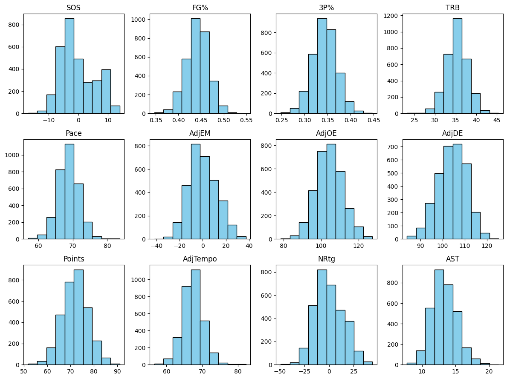

# Advanced Bracketology - Predicting NCAA Tournament Seeds with Machine Learning

### Team

Quinn Robnett (point of contact) - qrobnett23

David Gold - goldrush777

Jordan Jones - jordanmsjones

### Introduction

Every year in March and April, college basketball takes center stage in the world of sports as the NCAA Tournament takes place. This 68 team tournament is what many believe to be the greatest event in all of sports. There are currently 363 teams in NCAA Division I, meaning only 18.7% of teams get to compete for the national championship. The teams competing are each given a "seed", 1 being the best and 16 being the worst. To decide which teams compete and what seeds they get, there is a selection committee. Every year, 32 teams automatically qualify by winning their conference tournaments. The committee must then select the remaining 36 "at-large" teams who will compete. After they have the field of 68, they must determine the seeds.

There are many "bracketologists" that try to predict what the 68 team bracket will look like based on metrics and how the committee values these metrics. Much of this is merely speculation and educated guessing. The committee does outline their criteria, but the decision making happens behind closed doors. Is their decision making predictable? Can we use team metrics to predict which teams will make the tournament and the percentage chance they get each seed?

In this study, we attempt to build a robust machine learning model that will predict the probability that a team will make the tournament, as well as probabilities for earning each seed. For example, our model might show that a team has a 50% chance at making the tournament, a 25% shot at a 16 seed, and a 25% chance at a 15 seed. We do this by using ensemble machine learning methods such as random forests and XGBoost models.

Given that our Machine Learning model’s main goal is to project which college basketball teams will make March Madness, and in what seed, our findings will provide benefits to various stakeholders. Our primary stakeholders are the fans and bettors who benefit from having increased insight on how well teams can be expected to perform. Bettors and sportsbooks alike will have more tools available to them to find valuable underdogs in the tournaments and produce more odds, respectively. As for fans who simply prefer to watch games, casual fans will be able to get a better gauge on their team’s quality, and how well they can expect them to do in the future. This will help them make decisions on whether or not they should spend money on games, merchandise, etc. in the near future. 

For more dedicated fans, our model can help them get a jump on tickets to March Madness games before prices go up if they can reasonably expect their team to make it in and make it far in the bracket. To that same extent, the schools behind the basketball programs can also take advantage by selling postseason tickets and merch to season ticket holders early once they know their team should make the tournament, or to hold off on those expenses if they can’t be sure.

**Summary of Results here**

### Literature Review

As mentioned above, the committee operates behind closed doors. No one will ever truly know how they make selections. However, they do claim to use some strategies for choosing the 36 at large teams. A March 2023 article from the NCAA[^1] outlines the tedious process of choosing the field of teams and seeding them. To select the teams, they go through a process with many steps. To start, each member separately chooses the 36 teams they believe deserve to be in the tournament. After comparing ballots, they add teams with enough votes, and then repeat the process many times. Once the 68 teams are set, they follow a similar procedure for seeding, systematically choosing the best teams and ranking them accordingly. So while the process for selecting teams is outlined, it is still unclear how the committee values different metrics to make their decisions.

There have been a plethora of attempts to predict NCAA Tournament games. Chartier et al[^2] attempted using different mathematical metrics to rank teams. Hall et al[^3] used machine learning techniques to predict NCAA game results after the bracket was made. Many other research papers we found were about this: predicting the games. However, there did not appear to be a whole lot of research attempting to predict tournament seeds. We are excited to be taking an approach to bracketology that not many people have. 

### Data and Methods

Our data for this study come from three sources. The first source is [College Basketball Reference](https://www.sports-reference.com/cbb/seasons/men/2024-school-stats.html) (SRCBB). [Sports Reference](https://www.sports-reference.com/) is a site home to statistics for many sports, including college basketball. The website updates daily with data pulled from the NCAA's API. The website itself houses a number of tables of data. The tables we sourced for our project are the "Basic School Stats", "Basic Opponent Stats", "Advanced School Stats", and "Advanced Opponent Stats" (toggled for per game statistics). We gathered data across nine season ranging from 2014-15 to 2023-24 (2019-20 season excluded, tournament was canceled due to COVID, seeds were not given)

Our second source is [Kenpom.com](https://kenpom.com/). KenPom is a website created by Ken Pomeroy. The website houses a number of advanced metrics calculated from formulas that he describes across the site (for one example, click [here](https://kenpom.com/blog/ratings-glossary/)). For our project, we used the main advanced ratings (the ones on the front page) from the same seasons mentioned above. Kenpom data also has the seed labels (our response variable). 

The last data source is [Team Rankings](https://www.teamrankings.com/ncaa-basketball/rpi-ranking/rpi-rating-by-conf?date=2024-03-27). The site was created by students at Stanford in 2000 and has grown to "over 200,000 pages of projections, stats, rankings, and odds." The data we will use from this site is the CBB Conference Ratings for the seasons mentioned above.

After joining the data from all three sources and removing unnecassary variables, we were left with a data set with a dataset with 3174 rows and 72 columns (71 estimators and the response). 63 of the attributes come from SRCBB and are basic per game statistics for both a team, and their opponents. This includes points, assists, rebounds, three point percentage, steals, blocks, etc. Also included in the SRCBB data is win percentage for conference games, home game, away games, and all games. 7 of the attributes are the more "advanced" statistics from KenPom, and they include adjusted efficiency margin, tempo, offensive efficiency, defensive efficiency, and more. The last attribute is the conference rating as discussed above from Team Rankings. Here is the first few rows with school and season included (later removed for modeling):

| School            | Wpct  | SRS     | SOS    | Points | Opp_Points | FGA  | FG%   | 3PA  | 3P%   | FTA  | FT%   | ORB  | TRB  | AST  | STL  | BLK  | TOV  | Opp_FGA | Opp_FG% | Opp_3PA | Opp_3P% | Opp_FTA | Opp_FT% | Opp_ORB | Opp_TRB | Opp_AST | Opp_STL | Opp_BLK | Opp_TOV | Pace | ORtg  | FTr   | 3PAr  | TS%   | TRB% | AST% | STL% | BLK% | eFG%  | TOV% | ORB% | FT/FGA | Opp_Pace | Opp_ORtg | Opp_FTr | Opp_3PAr | Opp_TS% | Opp_TRB% | Opp_AST% | Opp_STL% | Opp_BLK% | Opp_eFG% | Opp_TOV% | Opp_ORB% | Opp_FT/FGA | MOV    | OSRS   | DSRS   | DRtg   | NRtg    | Season | Tempo   | AdjTempo | OE      | AdjOE   | DE      | AdjDE   | AdjEM     | seed | Conference | Rating | Wpct_Conf | Wpct_Home | Wpct_Away |
| ----------------- | ----- | ------- | ------ | ------ | ---------- | ---- | ----- | ---- | ----- | ---- | ----- | ---- | ---- | ---- | ---- | ---- | ---- | ------- | ------- | ------- | ------- | ------- | ------- | ------- | ------- | ------- | ------- | ------- | ------- | ---- | ----- | ----- | ----- | ----- | ---- | ---- | ---- | ---- | ----- | ---- | ---- | ------ | -------- | -------- | ------- | -------- | ------- | -------- | -------- | -------- | -------- | -------- | -------- | -------- | ---------- | ------ | ------ | ------ | ------ | ------- | ------ | ------- | -------- | ------- | ------- | ------- | ------- | --------- | ---- | ---------- | ------ | --------- | --------- | --------- |
| Abilene Christian | 0.471 | \-4.09  | \-1.09 | 72.1   | 73.5       | 58.4 | 0.433 | 15.6 | 0.34  | 22.3 | 0.727 | 9.68 | 33.5 | 12.7 | 7.71 | 2.12 | 12.8 | 56.6    | 0.462   | 18      | 0.325   | 22.5    | 0.685   | 10.1    | 36.8    | 12.4    | 6.68    | 3.32    | 14.6    | 71.1 | 100.3 | 0.381 | 0.267 | 0.522 | 47.7 | 50.1 | 10.7 | 5.5  | 0.479 | 15.6 | 26.6 | 0.277  | 71.1     | 102.2    | 0.398   | 0.319    | 0.547   | 52.3     | 47.3     | 9.3      | 7.8      | 0.514    | 17.8     | 29.7     | 0.273      | \-1.41 | \-2.5  | \-1.6  | 105.57 | \-5.51  | 2024   | 70.536  | 68.568   | 99.0523 | 101.657 | 103.331 | 105.601 | \-3.94377 | 17   | WAC        | 0.492  | 0.5       | 0.571429  | 0.666667  |
| Air Force         | 0.29  | \-4.52  | 1.68   | 66.2   | 72.4       | 51.7 | 0.453 | 24.4 | 0.361 | 15.3 | 0.682 | 7.26 | 28.1 | 14.5 | 6.52 | 3.94 | 12   | 52.6    | 0.475   | 19.3    | 0.366   | 20.5    | 0.747   | 9.58    | 32.8    | 12.5    | 5.74    | 3.1     | 11.2    | 63.4 | 103.6 | 0.296 | 0.472 | 0.56  | 46.2 | 62   | 10.2 | 11.8 | 0.538 | 16.9 | 23.8 | 0.202  | 63.4     | 113.2    | 0.391   | 0.367    | 0.58    | 53.8     | 49.9     | 9        | 11.3     | 0.542    | 15.3     | 31.5     | 0.292      | \-6.19 | \-6.49 | 1.98   | 112.94 | \-8.08  | 2024   | 63.4044 | 61.9052  | 103.451 | 106.062 | 113.982 | 113.186 | \-7.12408 | 17   | MWC        | 0.557  | 0.111111  | 0.25      | 0.153846  |
| Akron             | 0.686 | 2.87    | \-1.98 | 73.6   | 66.2       | 57.7 | 0.453 | 24.7 | 0.324 | 18.3 | 0.727 | 10.4 | 36.5 | 13   | 5.63 | 2.86 | 11.3 | 56.7    | 0.43    | 21.1    | 0.304   | 16      | 0.688   | 8.83    | 32.4    | 11.2    | 5.86    | 2.49    | 11.5    | 66.9 | 109.6 | 0.318 | 0.428 | 0.555 | 53   | 49.7 | 8.4  | 8    | 0.523 | 14.5 | 30.6 | 0.231  | 66.9     | 98.5     | 0.283   | 0.372    | 0.514   | 47       | 45.8     | 8.7      | 7.5      | 0.486    | 15.2     | 25.2     | 0.194      | 7.46   | \-2.17 | 5.04   | 101.51 | 4.15    | 2024   | 66.7263 | 66.02    | 107.361 | 106.781 | 100.275 | 102.14  | 4.64076   | 14   | MAC        | 0.477  | 0.722222  | 0.928571  | 1         |
| Alabama           | 0.676 | 20.86   | 11.03  | 90.7   | 80.9       | 64.6 | 0.477 | 30.1 | 0.367 | 23.2 | 0.776 | 12.7 | 39.7 | 16   | 7.26 | 4.24 | 12   | 63      | 0.436   | 23.2    | 0.313   | 25.3    | 0.739   | 11.8    | 35.5    | 12.4    | 7.5     | 4.41    | 11.7    | 74.4 | 121.1 | 0.359 | 0.465 | 0.6   | 52.8 | 52   | 9.7  | 10.7 | 0.563 | 13.7 | 34.9 | 0.278  | 74.4     | 108      | 0.402   | 0.369    | 0.539   | 47.2     | 45       | 10       | 12.8     | 0.494    | 13.5     | 30.3     | 0.297      | 9.82   | 21.82  | \-0.96 | 97.41  | 28.99   | 2024   | 74.335  | 72.9246  | 121.389 | 125.111 | 107.597 | 102.31  | 22.8014   | 4    | SEC        | 0.563  | 0.722222  | 0.875     | 1.3       |
| Alabama A&M       | 0.343 | \-14.28 | \-7.45 | 69     | 75.8       | 54.8 | 0.42  | 14.7 | 0.287 | 25.9 | 0.722 | 11.3 | 35.7 | 10.5 | 7.46 | 3.89 | 16.1 | 57.4    | 0.426   | 21.2    | 0.352   | 25.9    | 0.749   | 11.9    | 35.9    | 13.2    | 9.46    | 3.26    | 14.1    | 71.7 | 95.8  | 0.472 | 0.269 | 0.514 | 49.8 | 45.8 | 10.4 | 10.7 | 0.459 | 19.4 | 31.9 | 0.341  | 71.7     | 105.3    | 0.452   | 0.369    | 0.543   | 50.2     | 54.1     | 13.1     | 8.1      | 0.491    | 16.8     | 32.7     | 0.338      | \-6.83 | \-7.29 | \-6.99 | 110.45 | \-19.47 | 2024   | 71.7111 | 70.6173  | 95.9575 | 94.2041 | 104.979 | 108.554 | \-14.3499 | 17   | SWAC       | 0.438  | 0.5       | 0.583333  | 0.473684  |

Below are histograms of some of the key variables. Unsurprisingly, all of our predictors are approximately normal.

Before modeling, all columns (aside from any win percentage column and conference rating) were standardized within each season. This was done to remove any bias due to a systematic change in any statistic over time. For example, it might be the case that points per game could increase year by year as teams and players become more talented and as rules are changed. Standardizing within a season will still give us an idea of how a team performed relative to other teams in a season.

We attempted two different models for this study: random forest and XGBoost. For each model, we used 5-fold cross validation and parameter tuning. For model evaluation, we could not rely on accuracy alone. Given the nature of the problem, any model will likely have a high accuracy given the imbalance of the classes. Many more teams miss the tournament altogether than those who earn a seed. We also could not rely simply on the predictions output by the model. Many teams in worse conferences would get an output of 17 (our placeholder for missing the tournament). To counteract these issues, we had to "manually" assign seeds. To do this, we started by taking the weighted average probabilities for each class (a team with a 75% chance for a 1 seed and a 25% chance for a 2 seed would get 1.25). After obtaining these values, we took the lowest score from each conference and assigned those as our automatic-qualifiers. We then took the 36 remaining lowest weighted averages to round out our 68-team field. We then assigned seeds based on lowest weighted average. The lowest four would be assigned a 1 seed, the next four a 2 seed, and so on (there are six 11 seeds and six 16 seeds). This method of classification provides a realistic prediction for what the tournament could look like.

After creating these predictions, we created two metrics for model evaluation: hit percentage and seed MSE. Hit percentage is the percentage of teams that actually made the tournament that we correctly predicted would make the tournament. Seed MSE is taking the mean squared error of the predicted and actual seed for hits (made the tournament and were predicted to).

### Results and Discussion

After training random forest and XGBoost models, the model that performed best on the test set (2024 season) was an XGBoost model with a max_depth of 5, a learning rate of 0.1, and an n_estimators of 100. This model produced a hit percentage of 76.47% and a seed MSE of 2.75. Below is a full table of the 68-team field generated from the model:

| team               | conf      | seed | w_pred   | status | prediction |
| ------------------ | --------- | ---- | -------- | ------ | ---------- |
| Arizona            | Pac-12    | 2    | 1.84073  | aq     | 1          |
| Houston            | Big 12    | 1    | 2.121538 | aq     | 1          |
| Purdue             | Big Ten   | 1    | 2.149973 | aq     | 1          |
| Connecticut        | Big East  | 1    | 2.280924 | aq     | 1          |
| Illinois           | Big Ten   | 3    | 2.516335 | no     | 2          |
| Auburn             | SEC       | 4    | 2.706042 | aq     | 2          |
| North Carolina     | ACC       | 1    | 3.137618 | aq     | 2          |
| Tennessee          | SEC       | 2    | 3.469917 | no     | 2          |
| Iowa State         | Big 12    | 2    | 3.63216  | no     | 3          |
| Alabama            | SEC       | 4    | 3.903245 | no     | 3          |
| Gonzaga            | WCC       | 5    | 4.053419 | aq     | 3          |
| Baylor             | Big 12    | 3    | 4.139561 | no     | 3          |
| Duke               | ACC       | 4    | 4.756427 | no     | 4          |
| San Diego State    | MWC       | 5    | 5.504986 | aq     | 4          |
| Marquette          | Big East  | 2    | 5.7479   | no     | 4          |
| Creighton          | Big East  | 3    | 5.808488 | no     | 4          |
| Kentucky           | SEC       | 3    | 5.862486 | no     | 5          |
| Kansas             | Big 12    | 4    | 6.157814 | no     | 5          |
| Colorado           | Pac-12    | 10   | 6.813076 | no     | 5          |
| Clemson            | ACC       | 6    | 7.129649 | no     | 5          |
| Colorado State     | MWC       | 10   | 7.459778 | no     | 6          |
| Texas Tech         | Big 12    | 6    | 7.477046 | no     | 6          |
| Florida            | SEC       | 7    | 7.570517 | no     | 6          |
| Michigan State     | Big Ten   | 9    | 7.688351 | no     | 6          |
| Mississippi State  | SEC       | 8    | 7.71822  | no     | 7          |
| Nebraska           | Big Ten   | 8    | 7.818685 | no     | 7          |
| Texas              | Big 12    | 7    | 8.115783 | no     | 7          |
| Saint Mary's       | WCC       | 5    | 8.121921 | no     | 7          |
| BYU                | Big 12    | 6    | 8.196829 | no     | 8          |
| Washington State   | Pac-12    | 7    | 8.533127 | no     | 8          |
| Wisconsin          | Big Ten   | 5    | 8.590712 | no     | 8          |
| Boise State        | MWC       | 10   | 8.658482 | no     | 8          |
| Northwestern       | Big Ten   | 9    | 8.80108  | no     | 9          |
| New Mexico         | MWC       | 11   | 8.879713 | no     | 9          |
| Nevada             | MWC       | 10   | 8.883742 | no     | 9          |
| St. John's (NY)    | Big East  | 17   | 9.274657 | no     | 9          |
| Pittsburgh         | ACC       | 17   | 10.0142  | no     | 10         |
| Dayton             | A-10      | 7    | 10.55753 | aq     | 10         |
| Oregon             | Pac-12    | 11   | 10.84027 | no     | 10         |
| Virginia           | ACC       | 10   | 11.32388 | no     | 10         |
| Florida Atlantic   | AAC       | 8    | 11.85617 | aq     | 11         |
| Indiana State      | MVC       | 17   | 12.30735 | aq     | 11         |
| Drake              | MVC       | 10   | 12.38658 | no     | 11         |
| James Madison      | Sun Belt  | 12   | 12.43633 | aq     | 11         |
| Utah State         | MWC       | 8    | 12.87717 | no     | 11         |
| Seton Hall         | Big East  | 17   | 12.88611 | no     | 11         |
| Wake Forest        | ACC       | 17   | 13.12767 | no     | 12         |
| Princeton          | Ivy       | 17   | 13.18866 | aq     | 12         |
| Ohio State         | Big Ten   | 17   | 13.22279 | no     | 12         |
| McNeese State      | Southland | 12   | 13.2641  | aq     | 12         |
| Vermont            | AEC       | 13   | 13.69557 | aq     | 13         |
| Grand Canyon       | WAC       | 12   | 14.20567 | aq     | 13         |
| Samford            | Southern  | 13   | 14.80981 | aq     | 13         |
| High Point         | Big South | 17   | 16.22367 | aq     | 13         |
| Charleston         | CAA       | 13   | 16.2315  | aq     | 14         |
| South Dakota State | Summit    | 15   | 16.36682 | aq     | 14         |
| Louisiana Tech     | CUSA      | 17   | 16.39341 | aq     | 14         |
| Colgate            | Patriot   | 14   | 16.41412 | aq     | 14         |
| Morehead State     | OVC       | 14   | 16.53728 | aq     | 15         |
| UC Irvine          | Big West  | 17   | 16.68938 | aq     | 15         |
| Merrimack          | NEC       | 17   | 16.73151 | aq     | 15         |
| Lipscomb           | A-Sun     | 17   | 16.7461  | aq     | 15         |
| Norfolk State      | MEAC      | 17   | 16.75614 | aq     | 16         |
| Ohio               | MAC       | 17   | 16.7825  | aq     | 16         |
| Oakland            | Horizon   | 14   | 16.81788 | aq     | 16         |
| Fairfield          | MAAC      | 17   | 16.85239 | aq     | 16         |
| Montana            | Big Sky   | 17   | 16.87863 | aq     | 16         |
| Grambling          | SWAC      | 16   | 16.95839 | aq     | 16         |

Given the unknowns in college basketball, we believe that this model shows promising results. Because the data were collected before conference tournaments for 2024, it is unreasonable to accurately predict every team that makes a tournament, and this is for two main reasons: one bid leagues and bid stealers. A one bid league is a weaker conference where the only team that will make the NCAA tournament is the team that wins the conference tournament. Prior to the tournament happening, all we can do is predict who we think will win the conference tournament. So, the model gives the most likely team. However, in many cases, the "best" team doesn't win. So, there is more uncertainty with these predictions. On the other hand, there are bid stealers. There are teams in a multi-bid league that would not have made the NCAA tournament if not for winning the conference championship. A great example of this in 2024 is NC State, who resides in the Atlantic Coast Conference (ACC). Before the conference tournament, they were a bad team and would not have been anywhere close to making the tournament. The ACC also contains very good teams who would make it regardless. So, when NC State went on a miracle run to win the ACC Tournament, a 4-bid league turned into a 5-bid league. This pushes out a "bubble" team, or a team near the bottom of the non-automatic qualifiers. 2024 had a handful of bid stealers, making it even more difficult to predict who makes the tournament. So, correctly predicting 76.47% of the teams correctly is a positive sign.

The class assignment can also be adjusted so that as information about conference champions comes in, the seeds will adjust. We tested this by manually assigning the automatic qualifiers (instead of taking the lowest weighted average prediction from each conference), and redoing the prediction process explained earlier. After doing this, the model successfully predicted 91.67% of the 36 remaining "at-large" teams. The adjusted results can be seen in the table below:

| team | conf               | seed      | w_pred | status   | prediction |
| ---- | ------------------ | --------- | ------ | -------- | ---------- |
| 10   | Arizona            | Pac-12    | 2      | 1.84073  | no         | 1 |
| 111  | Houston            | Big 12    | 1      | 2.121538 | no         | 1 |
| 240  | Purdue             | Big Ten   | 1      | 2.149973 | no         | 1 |
| 58   | Connecticut        | Big East  | 1      | 2.280924 | aq         | 1 |
| 116  | Illinois           | Big Ten   | 3      | 2.516335 | aq         | 2 |
| 16   | Auburn             | SEC       | 4      | 2.706042 | aq         | 2 |
| 203  | North Carolina     | ACC       | 1      | 3.137618 | no         | 2 |
| 297  | Tennessee          | SEC       | 2      | 3.469917 | no         | 2 |
| 124  | Iowa State         | Big 12    | 2      | 3.63216  | aq         | 3 |
| 3    | Alabama            | SEC       | 4      | 3.903245 | no         | 3 |
| 101  | Gonzaga            | WCC       | 5      | 4.053419 | no         | 3 |
| 19   | Baylor             | Big 12    | 3      | 4.139561 | no         | 3 |
| 72   | Duke               | ACC       | 4      | 4.756427 | no         | 4 |
| 261  | San Diego State    | MWC       | 5      | 5.504986 | no         | 4 |
| 159  | Marquette          | Big East  | 2      | 5.7479   | no         | 4 |
| 61   | Creighton          | Big East  | 3      | 5.808488 | no         | 4 |
| 135  | Kentucky           | SEC       | 3      | 5.862486 | no         | 5 |
| 130  | Kansas             | Big 12    | 4      | 6.157814 | no         | 5 |
| 55   | Colorado           | Pac-12    | 10     | 6.813076 | no         | 5 |
| 50   | Clemson            | ACC       | 6      | 7.129649 | no         | 5 |
| 56   | Colorado State     | MWC       | 10     | 7.459778 | no         | 6 |
| 307  | Texas Tech         | Big 12    | 6      | 7.477046 | no         | 6 |
| 84   | Florida            | SEC       | 7      | 7.570517 | no         | 6 |
| 173  | Michigan State     | Big Ten   | 9      | 7.688351 | no         | 6 |
| 178  | Mississippi State  | SEC       | 8      | 7.71822  | no         | 7 |
| 191  | Nebraska           | Big Ten   | 8      | 7.818685 | no         | 7 |
| 301  | Texas              | Big 12    | 7      | 8.115783 | no         | 7 |
| 256  | Saint Mary's       | WCC       | 5      | 8.121921 | aq         | 7 |
| 29   | BYU                | Big 12    | 6      | 8.196829 | no         | 8 |
| 344  | Washington State   | Pac-12    | 7      | 8.533127 | no         | 8 |
| 354  | Wisconsin          | Big Ten   | 5      | 8.590712 | no         | 8 |
| 24   | Boise State        | MWC       | 10     | 8.658482 | no         | 8 |
| 216  | Northwestern       | Big Ten   | 9      | 8.80108  | no         | 9 |
| 195  | New Mexico         | MWC       | 11     | 8.879713 | aq         | 9 |
| 192  | Nevada             | MWC       | 10     | 8.883742 | no         | 9 |
| 286  | St. John's (NY)    | Big East  | 17     | 9.274657 | no         | 9 |
| 233  | Pittsburgh         | ACC       | 17     | 10.0142  | no         | 10 |
| 64   | Dayton             | A-10      | 7      | 10.55753 | no         | 10 |
| 227  | Oregon             | Pac-12    | 11     | 10.84027 | aq         | 10 |
| 337  | Virginia           | ACC       | 10     | 11.32388 | no         | 10 |
| 86   | Florida Atlantic   | AAC       | 8      | 11.85617 | no         | 11 |
| 121  | Indiana State      | MVC       | 17     | 12.30735 | no         | 11 |
| 70   | Drake              | MVC       | 10     | 12.38658 | aq         | 11 |
| 129  | James Madison      | Sun Belt  | 12     | 12.43633 | aq         | 11 |
| 328  | Utah State         | MWC       | 8      | 12.87717 | no         | 11 |
| 166  | McNeese State      | Southland | 12     | 13.2641  | aq         | 11 |
| 335  | Vermont            | AEC       | 13     | 13.69557 | aq         | 12 |
| 103  | Grand Canyon       | WAC       | 12     | 14.20567 | aq         | 12 |
| 259  | Samford            | Southern  | 13     | 14.80981 | aq         | 12 |
| 190  | NC State           | ACC       | 11     | 15.13796 | aq         | 12 |
| 54   | Charleston         | CAA       | 13     | 16.2315  | aq         | 13 |
| 274  | South Dakota State | Summit    | 15     | 16.36682 | aq         | 13 |
| 53   | Colgate            | Patriot   | 14     | 16.41412 | aq         | 13 |
| 185  | Morehead State     | OVC       | 14     | 16.53728 | aq         | 13 |
| 73   | Duquesne           | A-10      | 11     | 16.73367 | aq         | 14 |
| 2    | Akron              | MAC       | 14     | 16.78748 | aq         | 14 |
| 290  | Stetson            | A-Sun     | 16     | 16.79945 | aq         | 14 |
| 219  | Oakland            | Horizon   | 14     | 16.81788 | aq         | 14 |
| 359  | Yale               | Ivy       | 13     | 16.86728 | aq         | 15 |
| 315  | UAB                | AAC       | 12     | 16.87781 | aq         | 15 |
| 349  | Western Kentucky   | CUSA      | 15     | 16.92471 | aq         | 15 |
| 145  | Long Beach State   | Big West  | 15     | 16.95144 | aq         | 15 |
| 113  | Howard             | MEAC      | 16     | 16.95153 | aq         | 16 |
| 102  | Grambling          | SWAC      | 16     | 16.95839 | aq         | 16 |
| 257  | Saint Peter's      | MAAC      | 15     | 16.96421 | aq         | 16 |
| 147  | Longwood           | Big South | 16     | 16.9742  | aq         | 16 |
| 341  | Wagner             | NEC       | 16     | 16.97895 | aq         | 16 |
| 184  | Montana State      | Big Sky   | 16     | 16.9945  | aq         | 16 |

The only teams that we predicted to make it that ultimately did not were Indiana State, St. John's, and Pittsburgh. Many people believed these teams should have made it, so we are glad that our model agrees. Obviously, to be even more accurate, we would have liked to update the data after the conference tournament games occurred. However, in this case we did not have that luxury.

### Limitations

This is a difficult problem to model given all the moving parts with how teams are selected and seeded. There are factors that were impossible to take into account. For example, the committee has to consider the location of where the games are being played, teams from the same conference not being able to play each other in the first round, and more. For example, this year, the committee said BYU should have been a 5 seed, but the 5 seed would have played on Sunday, and BYU can't play on Sunday. Also, given the uncertainty of bid stealers and one-bid leagues, some of the middle and lower seeds can be more volatile.

### Future Work

There is a lot more we would like to do regarding this project. The first and most important is to create an interactive dashboard to provide our stakeholders with an easy-to-use product to help them with any use case they might need it for. We have been working on doing this in Tableau, however we struggled to figure it out and could not finish it in time for this deadline. Additionally, given the volatility and unpredictability of which teams make the tournament, we would like to add a level of confidence to each prediction; however, we are currently unsure how to accomplish this. These confidences attached to the prediction would change as the season went on. For example, a team such as Connecticut in 2024 would have a 1 seed prediction which would get more and more confident as they kept winning game throughout the season.

[^1]: [How the field of 68 DI men’s teams is picked for March Madness](https://www.ncaa.com/news/basketball-men/article/2023-03-09/how-field-68-di-mens-teams-picked-march-madness-each-season)

[^2]: [Bracketology? How can math help?](https://books.google.com/books?hl=en&lr=&id=WkqMPCVmF8oC&oi=fnd&pg=PA55&dq=bracketology&ots=yMX40dtS7c&sig=yZbwTFihjK22Q-CxyPxe5KTaXZg#v=onepage&q=bracketology&f=false)

[^3]: [Computational Bracketology](https://www.cs.dartmouth.edu/~lorenzo/teaching/cs174/Archive/Winter2013/Projects/FinalReportWriteup/harrison.k.hall.th.pdf)
